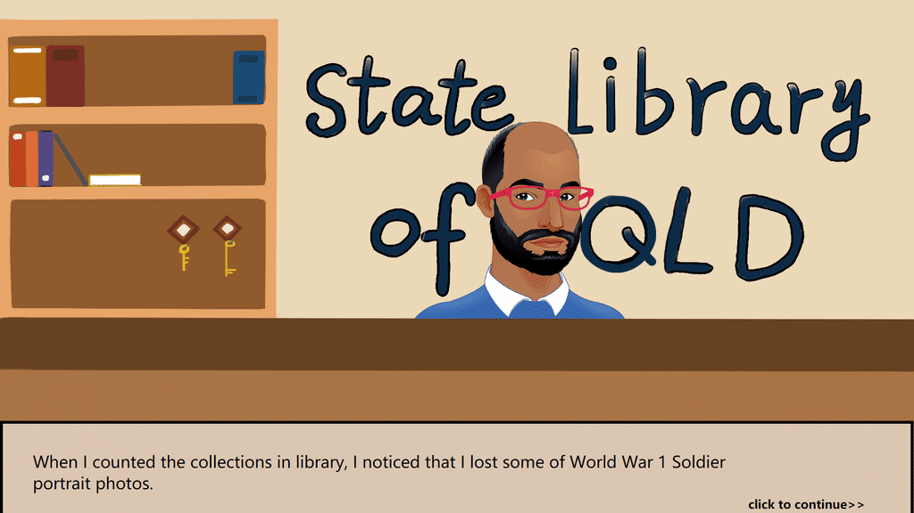
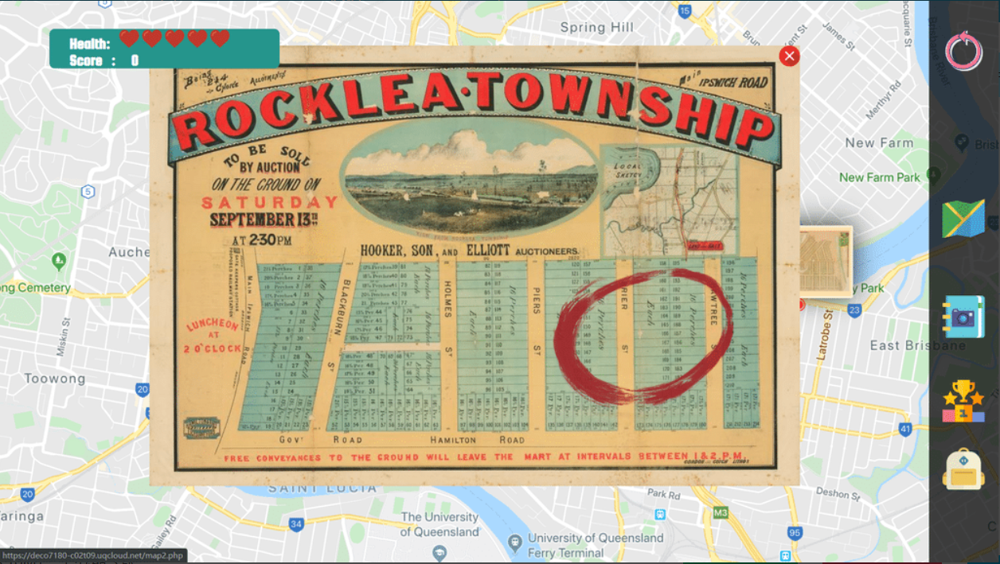
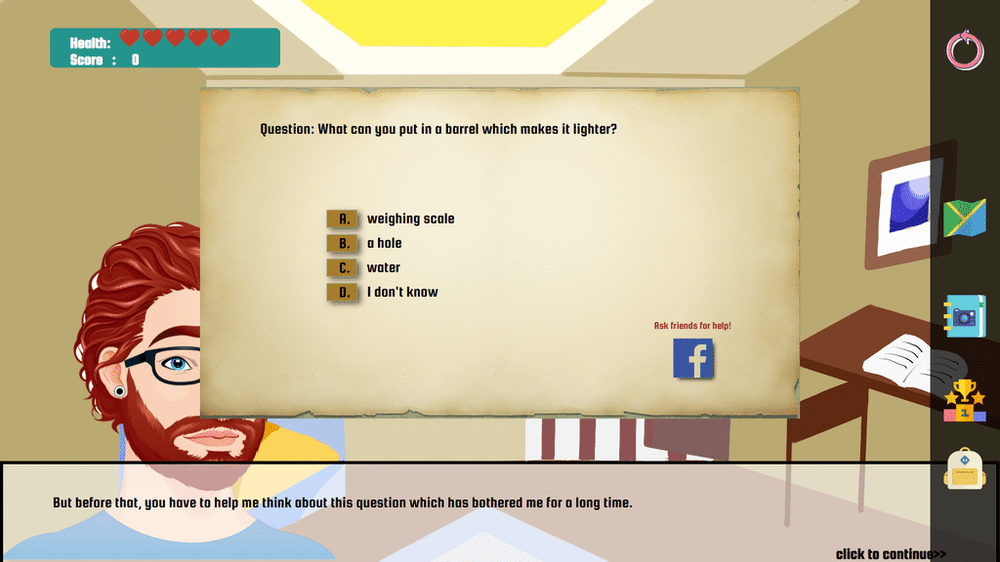
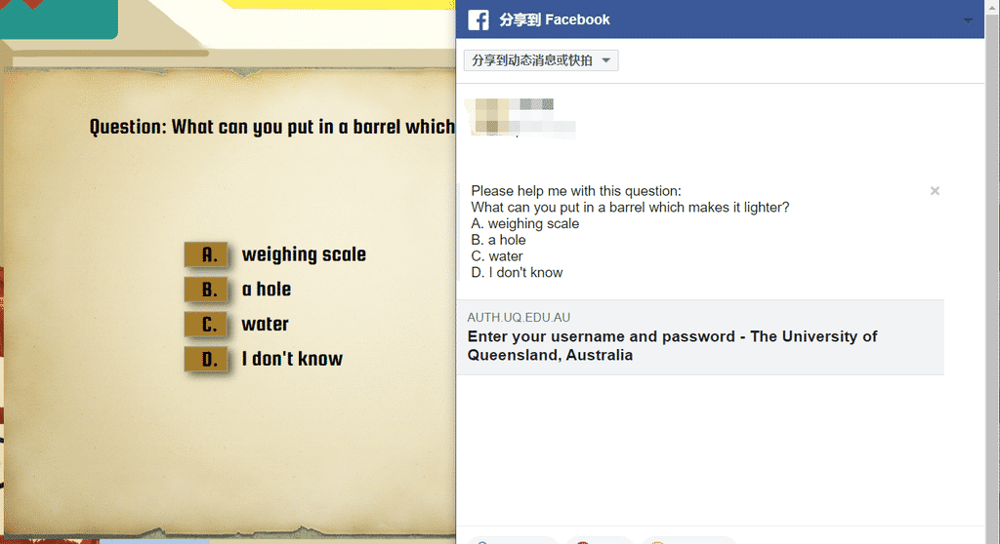
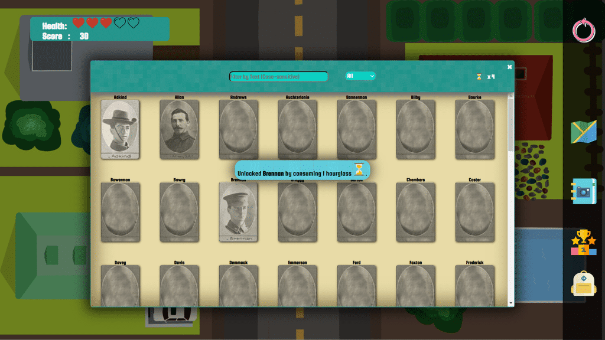

# 寻找遗失的肖像(Find Lost Portraits) 作品介绍

<!-- START doctoc generated TOC please keep comment here to allow auto update -->
<!-- DON'T EDIT THIS SECTION, INSTEAD RE-RUN doctoc TO UPDATE -->
Toc
- [项目背景介绍](#%E9%A1%B9%E7%9B%AE%E8%83%8C%E6%99%AF%E4%BB%8B%E7%BB%8D)
- [项目简介](#%E9%A1%B9%E7%9B%AE%E7%AE%80%E4%BB%8B)
- [项目展示](#%E9%A1%B9%E7%9B%AE%E5%B1%95%E7%A4%BA)

<!-- END doctoc generated TOC please keep comment here to allow auto update -->

### 项目背景介绍
> 本项目是我在昆士兰大学学习DECO7180交互技术工作室课程时所做的团队课程设计项目，
> 该项目由四人团队完成，我们共同设计了该项目并实施完成了其中的大部分内容。  
> 项目要求团队从 [昆士兰州立图书馆（State Library of Queensland）提供的众多数据集](https://www.data.qld.gov.au/dataset?_organization_limit=0&organization=state-library-queensland)
>中选取一组或多组数据，自由设计并实施完成一件WEB端的产品。  

### 项目简介
> 我们团队选取了[一战老兵肖像](https://www.data.qld.gov.au/dataset/slq-world-war-1-soldier-portraits)
> 与[昆州房地产老地图](https://www.data.qld.gov.au/dataset/real-estate-maps) 两个数据集作为产品的内容支撑，
> 设计了一款基于真实地图数据的解谜游戏。该项目：  
 * 主要面向低龄玩家
 * 允许玩家在多张地图间进行半自由化的探索
 * 游戏场景（地图）与谷歌地图实现真实坐标的映射（时间限制未完成，采用模拟数据）
 * 同时具备文字解谜与场景解谜
 * 具有收集属性和排行榜元素
 * 引入facebook与twitter的社交属性
 
### 项目展示
> 由于项目所在虚拟主机的公网访问限制以及部分源码的缺失，此处无法提供项目原始副本的游玩体验，
> 所有展示以图文方式进行。

在游戏的开始，玩家接受了昆州州立图书馆管理员的请求，使用初始的时光地图穿越回过去的街区，去寻找图书馆馆藏中丢失的老兵肖像。

每一张时光地图都映射到真实世界（Google Maps API）的一个坐标，使用该张地图可以解锁一个街区，随着游戏进程的发展，玩家可以不断解锁更多的地图。

每个地图（街区）有许多间房子，如果房子里有人，玩家进入之后会触发场景对话，成功解答对话中的谜题后，可以获得一件道具盒子，打开之后会随机获取道具。

解谜遇到困难时，可以一键分享到社交平台来求助。

对于无人的房屋，可以使用特定的钥匙（通过完成解谜获得）进入，并进行场景解谜。

在探索与解谜的过程中可以获得游戏中的重要道具-时光沙漏，用来复原一张丢失的肖像并赚取分数。

任何错误的尝试会消耗玩家的生命值，生命值耗尽后，游戏结束，玩家的分数会被计入排行榜。
.png)

